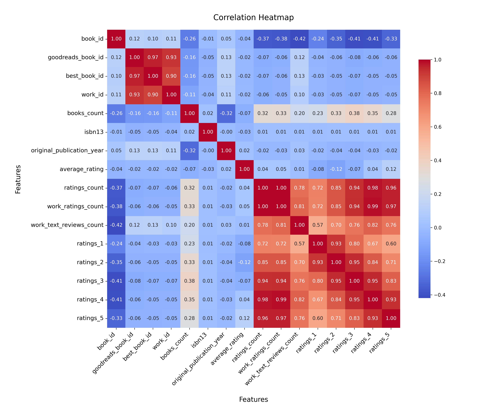

# Analysis Report

### Dataset Summary

The dataset consists of 10,000 entries with 23 columns, primarily containing information about books listed on Goodreads. The columns include identifiers, book details (title, author, publication year), ratings, and reviews. There are notable missing values in several fields, including ISBNs, original titles, and language codes. 

### Key Insights

1. **Missing Values**:
   - The `isbn` and `isbn13` columns have significant missing entries (700 and 585 respectively), indicating potential issues in data collection or entry.
   - The `original_publication_year` has 21 missing values, which could affect analyses related to publication trends over time.
   - The `language_code` column is missing 1,084 entries, which is concerning for language-specific analyses.

2. **Author Popularity**:
   - There are 4,664 unique authors in the dataset, with Stephen King being the most frequent author (60 occurrences). This suggests a skew towards popular authors, which may influence average ratings and reviews.

3. **Publication Year Trends**:
   - The average original publication year is 1981, with a range from -1750 to 2017. This indicates that the dataset includes both classic and contemporary works. The distribution of publication years could be visualized to understand trends over time.

4. **Ratings Overview**:
   - The average rating across all books is approximately 4.00, suggesting that users tend to rate books highly.
   - The distribution of ratings (1-5) shows that the average count of 5-star ratings is 23,789.8, indicating a strong preference for higher ratings.
   - The `ratings_count` averages around 54,001, which reflects a significant level of user engagement.

5. **Language Distribution**:
   - The `language_code` column has 25 unique languages, with English being the most common (6,341 occurrences). This indicates a predominant focus on English-language literature.

### Recommendations

1. **Data Cleaning**:
   - Address the missing values, particularly in the `isbn`, `isbn13`, `original_title`, and `language_code` fields. Techniques such as imputation or removal of affected entries could enhance dataset quality.

2. **Expand Author Diversity**:
   - To avoid bias towards popular authors, consider including a broader range of authors in future data collection efforts. This would provide a more representative view of the literary landscape.

3. **Trend Analysis**:
   - Conduct a detailed analysis of publication years to identify trends in ratings and reviews over time. Visualizations such as histograms or line graphs could be effective in presenting this data.

4. **Language-Specific Analysis**:
   - Given the missing language data, consider focusing on English works for detailed analyses while also attempting to fill in gaps for non-English titles. This could involve exploring translations or editions in other languages.

5. **User Engagement Strategies**:
   - Investigate factors that contribute to high ratings and reviews, and implement strategies to promote user engagement, such as author interviews, reading challenges, or book clubs.

By addressing these insights and recommendations, the dataset could be leveraged more effectively for analysis and insights into reader preferences and trends in literature.

