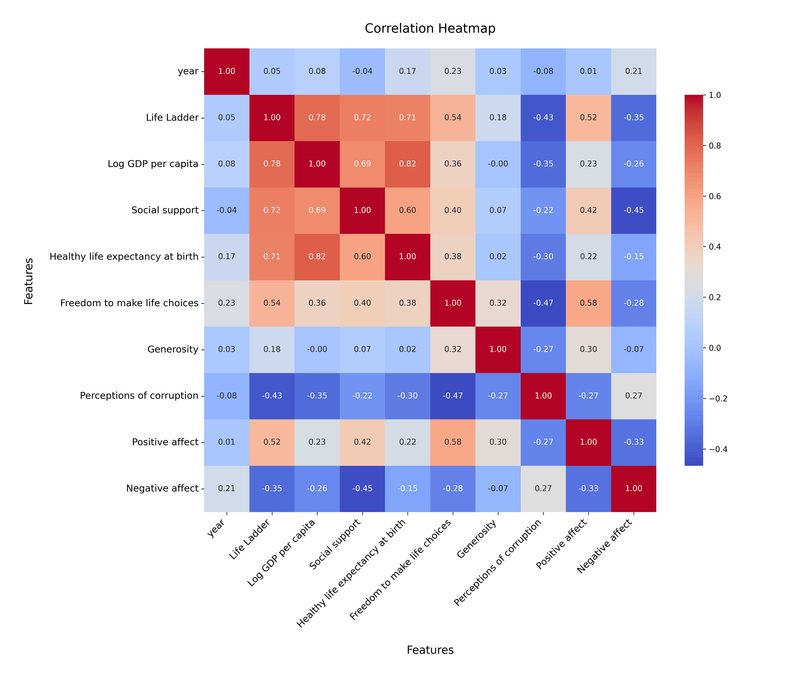

# Analysis Report

### Summary of the Happiness Dataset

The dataset `happiness.csv` consists of 2,363 rows and 11 columns, capturing various factors influencing happiness across different countries over several years. The columns include demographic information such as 'Country name' and 'year', as well as various indicators of well-being including 'Life Ladder', 'Log GDP per capita', 'Social support', 'Healthy life expectancy at birth', 'Freedom to make life choices', 'Generosity', 'Perceptions of corruption', 'Positive affect', and 'Negative affect'.

#### Key Insights

1. **Missing Values**: 
   - The dataset contains missing values across several columns, with the most significant gaps in 'Generosity' (81 missing), 'Perceptions of corruption' (125 missing), and 'Healthy life expectancy at birth' (63 missing). Handling these missing values is crucial for a comprehensive analysis.

2. **Statistical Overview**:
   - The average 'Life Ladder' score (5.48) suggests a moderate level of happiness among surveyed countries, with a maximum score of 8.019.
   - The mean 'Log GDP per capita' (9.40) reflects a generally high standard of living, but variations exist, indicating disparities in economic well-being.
   - The average 'Social support' score (0.81) signifies a strong sense of community, though the minimum value (0.228) indicates significant gaps in social support for some populations.
   - 'Freedom to make life choices' has a mean score of approximately 0.75, suggesting that many individuals feel they have autonomy in their decision-making processes.

3. **Well-Being Indicators**:
   - Higher 'Life Ladder' scores correlate with better 'Log GDP per capita' and 'Social support', indicating that economic factors and community ties significantly influence happiness.
   - The average 'Positive affect' score (0.65) is higher than the 'Negative affect' score (0.27), suggesting that people generally experience more positive emotions than negative ones.

#### Recommendations

1. **Address Missing Data**: 
   - It is critical to explore methods to impute or fill in missing values, especially for key indicators like 'Generosity' and 'Perceptions of corruption'. This will enhance the dataset’s reliability for analysis.

2. **Focus on Economic and Social Policies**:
   - Governments should prioritize policies that enhance economic conditions and social support systems, as these are strongly linked to increased happiness. Initiatives aimed at improving GDP and fostering community ties could lead to better outcomes in happiness metrics.

3. **Increase Awareness of Mental Health**: 
   - Programs that promote mental well-being and positive emotional experiences should be developed, especially in regions with lower 'Positive affect' scores. 

4. **Further Analysis**: 
   - Conduct deeper analyses to identify specific country trends over years, correlations between individual indicators, and potential causal relationships. Visualization tools can be employed to present these findings effectively.

Overall, the dataset provides a valuable snapshot of the factors influencing happiness across different nations, highlighting areas for improvement and the importance of economic and social support in enhancing overall well-being.

