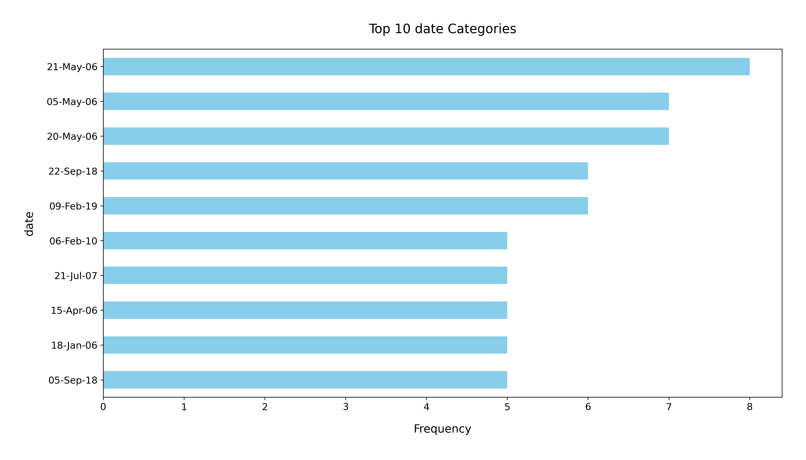

# Analysis Report

### Summary of the Dataset

The dataset `media.csv` contains 2,652 entries across 8 columns: `date`, `language`, `type`, `title`, `by`, `overall`, `quality`, and `repeatability`. The `date` column has the most significant missing values (99 entries), while the `by` column is missing 262 entries. Overall, the dataset contains various media types with a predominant focus on movies, as indicated by the `type` column, where movies account for 2211 out of 2652 entries.

### Key Insights

1. **Missing Values**:
   - The `date` and `by` columns have notable missing values, which could affect analyses that rely on these attributes. Addressing these gaps will be essential for a more comprehensive analysis.
  
2. **Language Distribution**:
   - The dataset includes 11 unique languages, with English being the most frequently represented (1,306 occurrences). This suggests a potential bias towards English media in the dataset.

3. **Media Type**:
   - Movies dominate the dataset (83.4% of entries), which may skew insights towards this particular media type. Exploring other types of media could provide a more balanced perspective.

4. **Ratings**:
   - The `overall`, `quality`, and `repeatability` ratings suggest a general trend towards moderate scores:
     - The average `overall` rating is approximately 3.05 (out of 5).
     - The average `quality` rating is about 3.21, indicating that most media is perceived as decent.
     - The `repeatability` scores average around 1.49, suggesting that most media is not often rewatched or revisited.

5. **Top Titles and Contributors**:
   - The title "Kanda Naal Mudhal" appears 9 times, indicating its popularity or prevalence in the dataset. The contributor "Kiefer Sutherland" has the highest frequency of mentions (48), which may highlight a significant presence in the media.

### Recommendations

1. **Address Missing Data**: 
   - Investigate the missing values in the `date` and `by` columns. Consider imputation strategies or removal of rows with missing crucial information to enhance data integrity.

2. **Broaden Media Types**:
   - If the goal is to analyze media more holistically, consider including more diverse media types beyond movies to enrich the dataset and attract a wider audience.

3. **Deeper Analysis on Ratings**:
   - Conduct further analysis on the correlation between `overall`, `quality`, and `repeatability` ratings. Understanding these relationships can provide insights into viewer preferences and satisfaction.

4. **Language Consideration**:
   - Explore the potential biases in language representation and consider adjusting the dataset to include a more balanced spread of languages, if relevant to the analysis.

5. **Visualizations**:
   - Utilize visualizations (e.g., bar charts for language distribution, pie charts for media types, and scatter plots for rating correlations) to effectively communicate insights and trends derived from the dataset.

By implementing these recommendations, the analysis can yield more comprehensive insights and enhance the understanding of the media landscape represented in the dataset.

